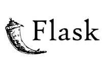
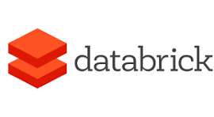
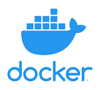
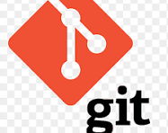

   

 
 

## 🚀 `About Me`
Results-driven, GCP Cloud Data Engineer and Python Developer with over 2.5 years of experience at Capgemini, specializing inREST API development using Flask and Django. Skilled in designing and implementing end-to-end data pipelines on Google CloudPlatform (GCP) with tools like Cloud Dataflow (Apache Beam) and Cloud Composer (Airflow). Proficient in ETL processes, datamigration, working with relational databases such as SQL and Spanner, as well as Big Data technologies like BigQuery and NoSQLdatabases such as MongoDB. Expertise in data processing, storage, and retrieval, with advanced Python skills, leveraging pandas andPySpark for data manipulation and analysis. 

## 🔧 `Technologies & Tools`
- **Languages/Databases:** Python, SQL, PySpark, HTML, terraform, shell Scripting (unix), mongoDB
- **Cloud/Bigdata:** GCP (data Flow, Composer, Dataproc, bigQuery, pub/sub), Databricks , snowflake, kafka
- **Frameworks:** Flask, Django
- **Libraries:** pandas, NumPy, Matplotlib, Requests, csv, Json, Streamlit, sqlite
- **CI/CD Testing:** Pytest, unittest, postman, jenkins, Docker, GIT

## 📂 `My Projects`
**1. *CCA Data Engineer [Dec 2024 – Present ]** 
- Architected resilient serverless data pipelines leveraging Cloud Run, Cloud Functions, and Cloud Pub/Sub, processing 500,000+daily events with 99.99% uptime and minimal latency, ensuring reliable data delivery. 
- Implemented Infrastructure as Code (IaC) using Terraform, automating cloud resource provisioning and management, reducing deployment time by 60%. 
- Created a Python script to automate fetching, processing, and retransmitting 1,000+ payloads affected by pip.

**2. *CDS Developer [ Jan 2024 – Dec 2024 ]** 
- Developed and maintained 24+ REST APIs across 7+ API groups, resolving 50+ critical bugs and performance issues, improvingresponse times by 40%.
- Successfully led the go-live of one market, collaborating with a team comprising one architect and one tester.
- Automated daily batch data exports using Apache Airflow DAGs, eliminating manual intervention and ensuring timely datadelivery to 10+ upstream systems.
- Engineered batch data pipelines processing thousands of records daily with 99.98% reliability, utilizing Dataflow, Cloud Run, Cloud Functions, and Pub/Sub.
- Contributed to the migration of large volumes of historical data to Cloud Spanner. 
- Independently resolved a security breach by modifying Dataflow code for 180+ batch jobs, ensuring secure and compliant secret management

**3. *Data Engineer [ Nov 2023 – Dec 2024 ]**
- Optimized batch data pipelines on Cloud Run & BigQuery, enabling the processing of 20+ terabytes of data within a sub-3-hourservice level agreement, satisfying critical stakeholder requirements.

**4. *PySpark ETL Pipeline using Kafka**
- Skills : Python, Pyspark, SQL, Logging, Pytest , GitHub
- Built a PySpark-based ETL pipeline designed to read, transform, and stream data to upstream systems using Kafka.
- 👉[Check Code here](https://github.com/Rohit-Sandanshiv/pyspark_kafka_project)

**5. *Consumer Management REST API**
- skills: Python , Flask, SQLite, requests, JSON , GitHub
- Consumer Management API: This is a simple Flask-based REST API for managing consumers, products, and purchases. It supports adding, updating, and retrieving consumer details using POST and GET requests via Python’s requests module.
- 👉[Check Code here](https://github.com/Rohit-Sandanshiv/python_api)

**6. * Scalable Purchase Pipeline on GCP**
- Python, Django, Cloud Run, Cloud Run Functions, Pub/Sub, Dataflow , Docker, GitHub
- Purchase API hosted on Cloud Run, loading data into MongoDB database using a Dataflow, Cloud Functions, and Pub/Sub.
- 👉[Check Code here](https://github.com/Rohit-Sandanshiv/django_cloudRun_Project) 

## 🎓 `Education`
- **College of Engineering, Pune(COEP) - Pune**
- **B. Tech. Mechanical Engineering**
- **Graduation:** May 2022
- **CGPA:** 8.16/10
- **Honours Degree:** Automotive Engineering

## `COURSES & CERTIFICATIONS`
- **Associate Cloud Engineer certification**
- **The Complete SQL Bootcamp - Udemy**
- **Python programming for Everybody -(Coursera University of Michigan)**
- **Google cloud professional data engineer course – Udemy**
- **Apache-spark-programming-in-python-for-beginners -Udemy**
- **terraform-for-beginners-using-google-cloud - Udemy**

## 📄 `Resume`
[Check here](utils/Rohit_Sandanshiv_Resume.pdf)

## `Connect With me`
Reach out to me **rssandanshiv782000@gmail.com**

Linkdin :**https://www.linkedin.com/in/rohit-sandanshiv-0785a71a7/**

Hackerrank: **https://www.hackerrank.com/profile/rssandanshiv7821**

 

  
    &nbsp;&nbsp;&nbsp;
  
    &nbsp;&nbsp;&nbsp;
  

<h3 align="left">Languages, Tools & Frameworks :</h3>

 
  
  &nbsp;&nbsp;&nbsp;
 
  &nbsp;&nbsp;&nbsp;
 
    &nbsp;&nbsp;&nbsp;
   
  &nbsp;&nbsp;&nbsp;
     
  &nbsp;&nbsp;&nbsp;
   
  &nbsp;&nbsp;&nbsp;
  
    &nbsp;&nbsp;&nbsp;
 
    &nbsp;&nbsp;&nbsp;
 
   
   
  
    &nbsp;&nbsp;&nbsp;
   
     &nbsp;&nbsp;&nbsp;
 
   &nbsp;&nbsp;&nbsp;
 
    &nbsp;&nbsp;&nbsp;
 
    &nbsp;&nbsp;&nbsp;
 
    &nbsp;&nbsp;&nbsp;
 
    &nbsp;&nbsp;&nbsp;
 
 

  
  <pre>🌟 Keep leveling up in the world of data & code! 🌟</pre>
     

